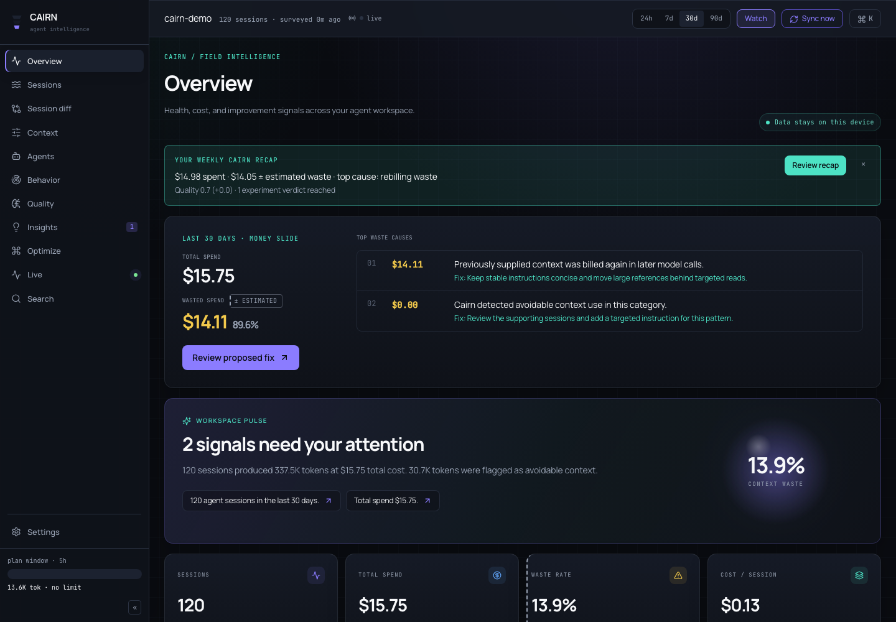
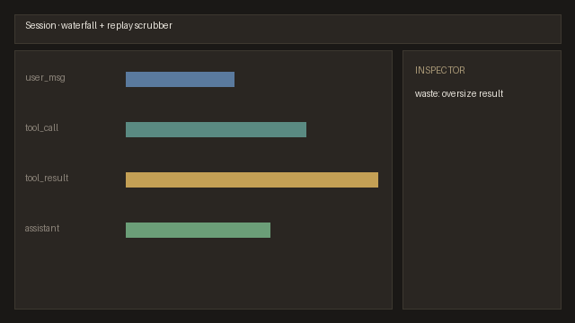

<p align="center">
  <svg xmlns="http://www.w3.org/2000/svg" width="72" height="56" viewBox="0 0 72 56" role="img" aria-label="Cairn">
    <ellipse cx="36" cy="44" rx="28" ry="10" fill="#6b5a45"/>
    <ellipse cx="36" cy="32" rx="22" ry="9" fill="#8a7355"/>
    <ellipse cx="36" cy="22" rx="16" ry="7" fill="#a89070"/>
    <ellipse cx="36" cy="14" rx="10" ry="5" fill="#c4ad87"/>
  </svg>
</p>

<p align="center">
  <strong>Cairn is local-first observability for AI coding agents — ingest sessions,<br>
  explain cost and quality with evidence, and measure instruction-file changes.</strong>
</p>

<p align="center">
  <a href="https://harsh-daga.github.io/Cairn/">Live static demo</a>
  · <a href="docs/README.md">Docs</a>
  · <a href="docs/pages.md">Pages hosting</a>
</p>

<p align="center">
  
  <a href="https://pypi.org/project/cairn-workspace/"></a>
  <a href="https://github.com/Harsh-Daga/Cairn/actions/workflows/ci.yml"></a>
  <a href="LICENSE"></a>
  
</p>

<p align="center">
  
</p>

---

## 60-second install

```bash
uv tool install cairn-workspace
cd your-repo && cairn
```

Also: `pip install cairn-workspace`, [install.sh](scripts/install.sh), or [install.ps1](install.ps1).
No account and no cloud. Stop with `cairn stop`. Update with `cairn upgrade`.

Agent bootstrap: paste the block from [AGENT_SETUP.md](AGENT_SETUP.md) (or `cairn setup-prompt`).

### After first run

Cairn syncs local agent logs into `.cairn/`, opens the dashboard on loopback, and shows an Overview
with spend, quality attention, and adapter health. First-run offers privacy/git-exclude steps when
needed. Collection mode controls backend auto-sync; browser Live updates are separate.

---

## What makes Cairn different

- **Verification receipts** — claim–evidence checks for session outcomes ([verification](docs/verification.md))
- **Session → regression** — scrubbed portable artifacts, no command execution ([regressions](docs/regressions.md))
- **Supervision / review risk** — corrections and advisory policy scoring ([policy](docs/policy.md))
- **Token & context evidence** — regions, rebilling, cache coverage ([ui tour](docs/ui-tour.md))
- **Outcome-linked compare** — agent metrics with intervals and confound notes
- **Measured Optimize / Guard** — instruction edits with before/after evidence ([optimize](docs/optimize.md))
- **Resource & Privacy Shield** — disk inventory, storage modes, egress ledger, circuit breakers
  ([resource shield](docs/resource-shield.md), [egress](docs/egress.md), [privacy via `cairn privacy`](docs/storage-modes.md))

---

## Supported agents

| Agent | Adapter | Notes |
|-------|---------|--------|
| Claude Code | `claude_code` | Measured usage when present |
| Codex CLI | `codex` | Measured usage when present |
| Cursor | `cursor` | Transcripts + `state.vscdb` |
| Cline / Roo / Kilo | `cline` family | Shared task JSON shape |
| Gemini CLI, Goose, Aider, OpenCode, Hermes, OpenClaw | see [adapters](docs/adapters.md) | Coverage varies |

Parse coverage and token methods are published in [ACCURACY.md](ACCURACY.md). Fixture canaries are
not a claim of 100% production reliability.

---

## Product tour

| Overview (desktop baseline) | Session waterfall | Optimize verdict |
|-----------------------------|-------------------|------------------|
|  |  |  |

Baselines under `docs/assets/v1.2/baseline/` are deterministic screenshot captures for layout checks.

---

## Local-first privacy

- Default bind `127.0.0.1`; no accounts; no silent network for default flows
- Opt-in reflector/provider calls require consent and are logged in `.cairn/egress.jsonl`
- Storage modes: `reference` / `metrics` / `balanced` / `forensic` ([storage modes](docs/storage-modes.md))
- Portable archive: `cairn archive export|inspect|import` ([archive](docs/archive.md))

### Honest limits

- Estimated tokens are labeled; not ground truth
- Optimize verdicts need adequate samples; methods and CIs are shown in-product
- Egress ledger cannot see traffic from unrelated agent processes
- Reference mode does not store raw `text_inline`; source drift is detected when logs move/rewrite

---

## CLI examples

| Command | What it does |
|---------|--------------|
| `cairn` | Sync and open the dashboard |
| `cairn sync` | Ingest agent logs into `.cairn/cairn.db` |
| `cairn show` | Text waterfall for a session |
| `cairn insights` | List detector insights |
| `cairn optimize` | Generate instruction proposals |
| `cairn check` | CI quality gate |
| `cairn privacy` | Privacy / storage / egress summary |
| `cairn resource` | Disk inventory and soft budget |
| `cairn archive export` | Versioned portable workspace archive |
| `cairn doctor` | Install and environment checks |
| `cairn mcp install` | Write MCP config for your agent |

Full surface: [docs/cli.md](docs/cli.md).

---

## Architecture

```
adapters / OTLP → normalize → SQLite ledger → views / detectors
                              ↓
              FastAPI ⇄ React UI (SSE) · CLI · MCP · export / archive
```

Single-writer SQLite, action registry parity (UI/CLI/API), static export for demos.

---

## Why Cairn

| Category | Examples | What Cairn adds |
|----------|----------|-----------------|
| Spend dashboards | [ccusage](https://github.com/ryoppippi/ccusage), [Tokscale](https://github.com/junhoyeo/tokscale) | Causal traces + waste taxonomy, not just totals |
| Context profilers | [ContextLens](https://pypi.org/project/contextlens-profiler/) | Multi-agent ledger + outcome and experiment views |
| Eval platforms | [OpenAI Evals](https://github.com/openai/evals) | Measurements from local coding-agent sessions |
| Observability standards | [OpenTelemetry](https://opentelemetry.io/) | Agent-specific analysis over local logs and OTLP |

---

## Docs · Contributing · Security · License

[Documentation home](docs/README.md) · [Getting started](docs/getting-started.md) ·
[CONTRIBUTING.md](CONTRIBUTING.md) · [SECURITY.md](SECURITY.md) · [SUPPORT.md](SUPPORT.md) ·
[CODE_OF_CONDUCT.md](CODE_OF_CONDUCT.md)

Apache-2.0 — see [LICENSE](LICENSE). Optional support: [buymeacoffee.com/harshdaga](https://buymeacoffee.com/harshdaga).
